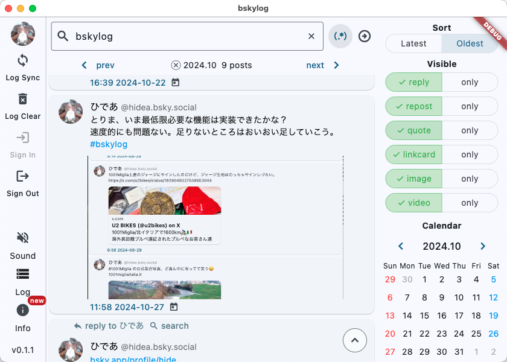
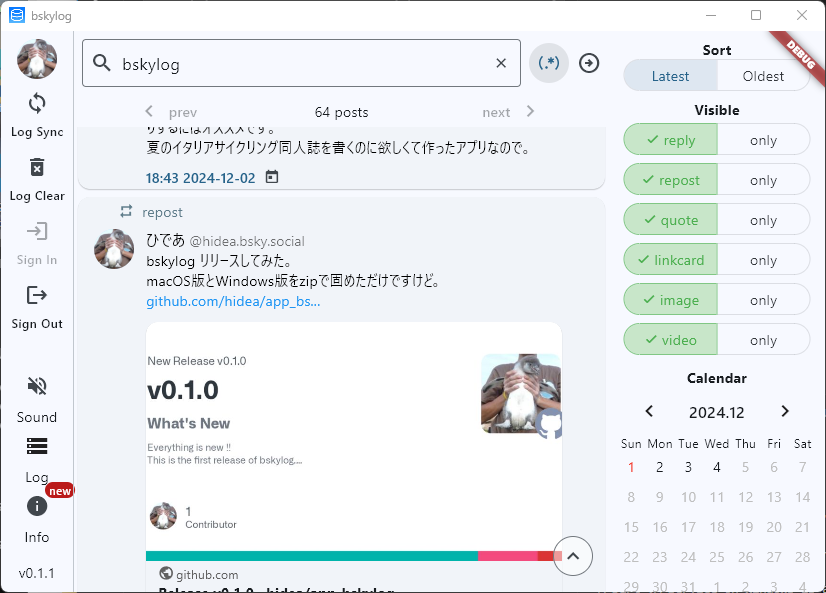

# bskylog

## Overview

This logged everything you have posted on Bluesky to local storage.

You can filter and view by keywords, date, and post type.

Screenshot of macOS

Screenshot of Windows

## Getting Started

Made in Flutter.

It works on macOS, Windows and iOS, Android maybe.

There have binary files for macOS and Windows.
Download and install the latest version from the GitHub [Releases page](https://github.com/hidea/app_bskylog/releases).

### macOS

If your Mac displays an alert when you open an app.
Please refer to the following document from Apple.

[Safely open apps on your Mac](https://support.apple.com/102445)

### Windows

If you get a message such as “The app you are trying to install is not a Microsoft verified app” and there is no install button,
you can install the app by changing the “Select where to get the app” in the settings.

## Operating system

- macOS 11 (Big Sur) or later
- Microsoft Windows 10 or later
- iOS, Android (not sure)
